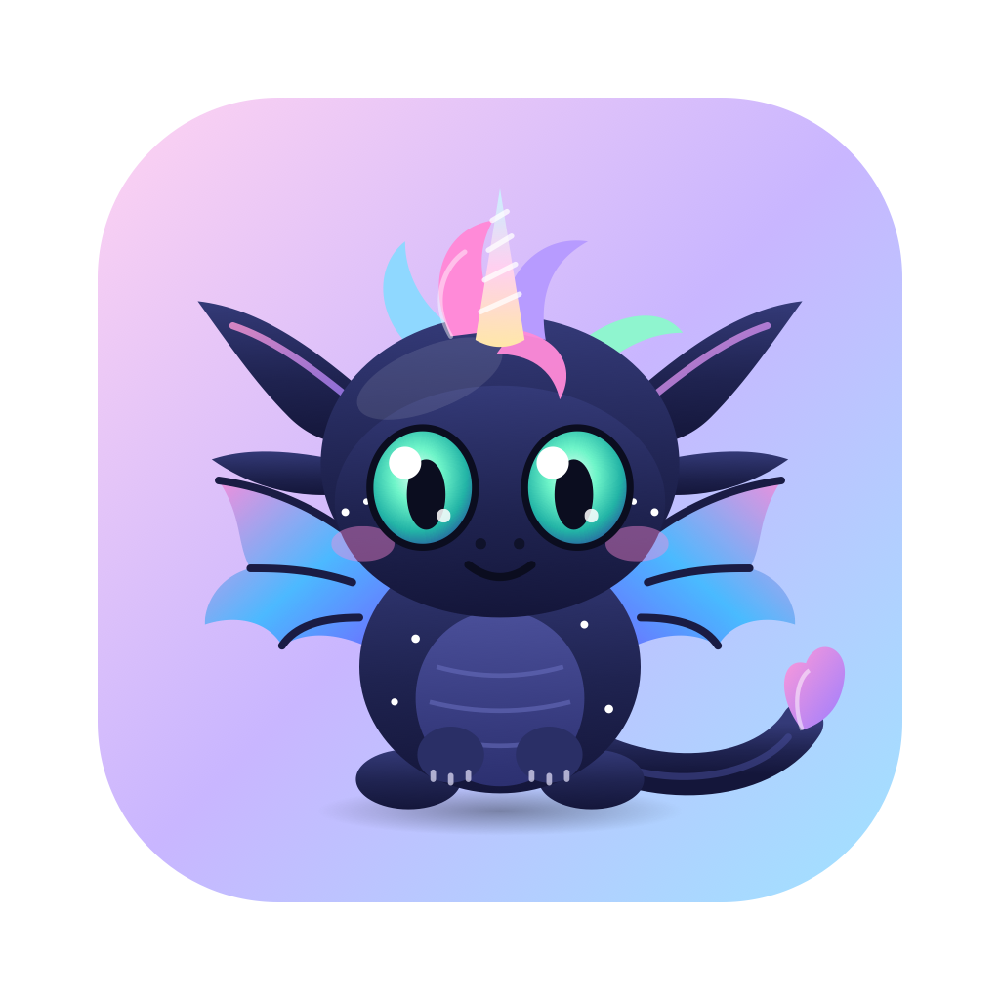

<p align="center"></p>

<h1 align="center">Lumi ✨</h1>
<p align="center"><b>A tiny dragon-unicorn who lives on your Mac desktop, dances to your Spotify, and chats with you using Claude.</b></p>

---

## What she does

- 🐉 **Floats on your desktop** above your windows. Drag her anywhere; she remembers where you left her.
- 🎵 **Vibes to your music.** When the Spotify app is playing, she bobs her head, flaps her wings and puffs out music notes. She'll tell you when the song changes.
- 💬 **Click her to chat.** Lumi is powered by Claude. She knows what song you're listening to.
- 😴 **Has feelings.** She blinks, perks up her ears when you hover, and dozes off if you ignore her for a while.
- Right-click her (or use the ✨ in the menu bar) for play/pause, next track, settings and quit.

## Install

1. Download **`Lumi-macOS.zip`** from the [latest release](../../releases/latest) and unzip it.
2. Drag **Lumi.app** into your **Applications** folder.
3. **First launch:** Lumi is a free indie app and isn't signed with a paid Apple developer certificate, so macOS will warn you.
   Double-click Lumi, close the warning, then go to **System Settings → Privacy & Security**, scroll down and click **Open Anyway**.
4. When macOS asks whether Lumi may control Spotify, click **OK** — that's how she knows what's playing.

Requires macOS 13 (Ventura) or newer. Works on Apple Silicon and Intel Macs.

## Chatting with Claude

Open the chat and tap **⚙︎** to pick how Lumi talks to Claude:

| Option | What you need | Cost |
| --- | --- | --- |
| **Claude Code login** | [Claude Code](https://claude.com/claude-code) installed and logged in on your Mac | Uses your existing Claude plan |
| **Anthropic API key** | A key from [console.anthropic.com](https://console.anthropic.com/settings/keys) | Pay-as-you-go, a fraction of a cent per message |

Your API key is stored only in your Mac's Keychain and is sent only to Anthropic. Chat history stays on your Mac.

## Build it yourself

You only need Apple's free command line tools (`xcode-select --install`).

```bash
git clone <this repo>
cd lumi-pet
./build.sh
open build/Lumi.app
```

How it's put together:

- `Sources/main.swift` — the native shell: a transparent, click-through floating window, the Spotify watcher (AppleScript), and the Claude chat bridge.
- `web/index.html` — Lumi herself: the SVG artwork, all the animations, and the chat panel.

Tip: you can redesign Lumi just by editing the SVG in `web/index.html` and running `./build.sh` again.

## Notes

- Spotify's desktop app doesn't share a song's tempo, so Lumi gives every song its own steady groove instead of matching the exact beat.
- Lumi is an original character. She's not affiliated with Spotify, Anthropic, or any film studio.

## License

MIT — free to use, change and share. Made with love (and Claude).
